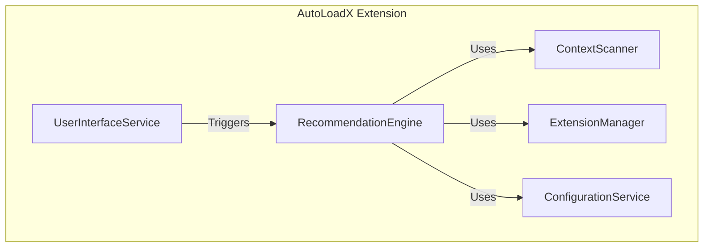
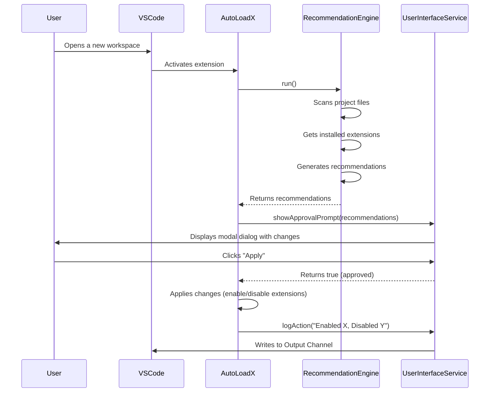
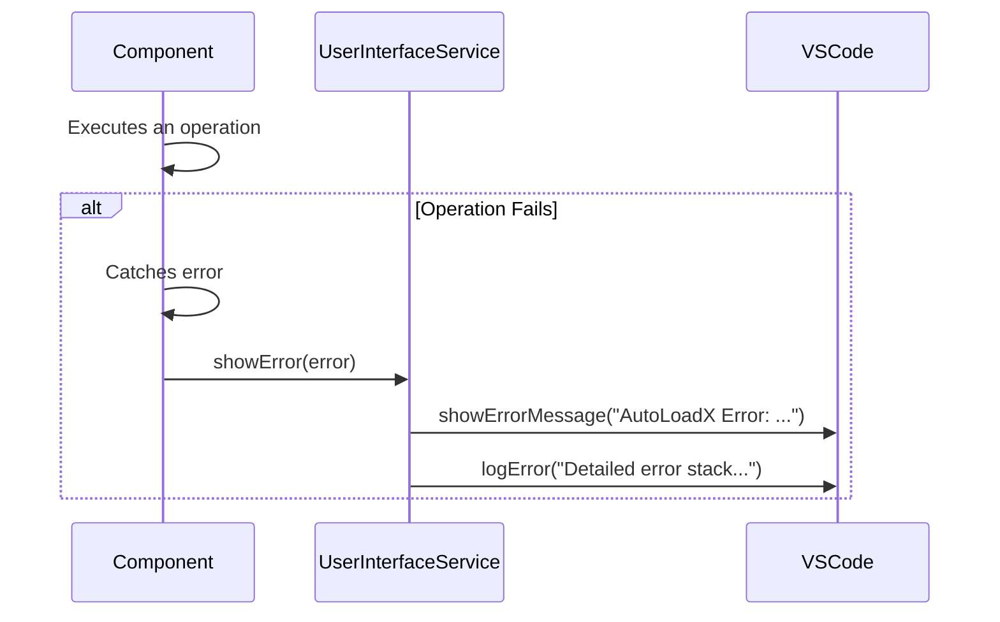

# AutoLoadX Fullstack Architecture Document

## Introduction

This document outlines the complete fullstack architecture for AutoLoadX, including backend systems, frontend
implementation, and their integration. It serves as the single source of truth for AI-driven development, ensuring
consistency across the entire technology stack.

This unified approach combines what would traditionally be separate backend and frontend architecture documents,
streamlining the development process for modern fullstack applications where these concerns are increasingly
intertwined.

### Starter Template or Existing Project

N/A - Greenfield project

### Change Log

| Date       | Version | Description   | Author              |
| :--------- | :------ | :------------ | :------------------ |
| 2025-08-08 | 0.1     | Initial draft | Winston (Architect) |

## High Level Architecture

### Technical Summary

AutoLoadX will be a client-side, monolithic VSCode extension built entirely in TypeScript. It will run within the VSCode
extension host, requiring no external backend services. The architecture prioritizes performance and user trust by
activating only when necessary, performing a quick, localized scan of the workspace, and presenting all proposed changes
for user approval. This design directly supports the PRD's goals of creating a seamless, "just works" experience that
improves developer workflow without adding noticeable overhead.

### Platform and Infrastructure Choice

**Platform:** VSCode Extension API **Key Services:**

- `vscode.extensions.all`: To inspect all installed extensions.
- `vscode.workspace.findFiles`: To scan the project for context.
- `vscode.window.showInformationMessage`: To display the approval prompt.
- `vscode.ConfigurationTarget.Global`: To programmatically enable/disable extensions.
- `vscode.window.createOutputChannel`: To log all actions for transparency. **Deployment Host and Regions:** N/A
  (Published to VSCode Marketplace)

### Repository Structure

**Structure:** Monorepo **Monorepo Tool:** npm Workspaces **Package Organization:** A single application package
(`apps/extension`) will be used for the MVP to keep the structure simple. This can be expanded later to include shared
packages if needed.

### High Level Architecture Diagram

```mermaid
graph TD
    subgraph User's Machine
        subgraph VSCode
            A[User Opens Workspace] --> B{AutoLoadX Extension};
            B -- Scans --> C[Project Files (.ts, package.json, etc.)];
            B -- Inspects --> D[Installed VSCode Extensions];
            C --> E{Recommendation Engine};
            D --> E;
            E --> F[Approval Prompt];
            F -- User Approves --> G[Apply Changes];
            F -- User Cancels --> H[End];
            G -- Enables/Disables --> D;
            G --> I[Output Channel Log];
        end
    end
```

### Architectural Patterns

- **Monolith (Client-Side):** The entire extension will be a single, self-contained unit running on the user's machine.
  _Rationale:_ This is the standard and most efficient architecture for a VSCode extension, requiring no network
  dependencies and simplifying development and deployment.
- **Observer Pattern:** The extension will use the VSCode API's activation events to "observe" when a new workspace is
  opened. _Rationale:_ This is a core performance best practice, ensuring the extension only runs when it's needed,
  minimizing its resource footprint.
- **Command Pattern:** The core logic of enabling/disabling extensions will be encapsulated in a command that is
  executed upon user approval. _Rationale:_ This decouples the user interface from the action, making the code cleaner
  and easier to test.

## Tech Stack

### Technology Stack Table

| Category             | Technology           | Version | Purpose                             | Rationale                                                                         |
| :------------------- | :------------------- | :------ | :---------------------------------- | :-------------------------------------------------------------------------------- |
| Frontend Language    | TypeScript           | 5.x     | Core extension language             | Standard for VSCode extensions; provides type safety and better maintainability.  |
| Frontend Framework   | None                 | N/A     | UI is built with native VSCode APIs | The UI is minimal (prompts, logs) and best handled by direct API calls.           |
| UI Component Library | VSCode UI Toolkit    | Latest  | Native UI components                | Ensures a consistent look and feel with the VSCode editor.                        |
| State Management     | None (Local)         | N/A     | State is managed within functions   | The extension's state is simple and transient, not requiring a dedicated library. |
| Backend Language     | None                 | N/A     | No backend service required         | The extension is fully client-side.                                               |
| Backend Framework    | None                 | N/A     | No backend service required         | The extension is fully client-side.                                               |
| API Style            | VSCode Extension API | Latest  | Interacting with the editor         | This is the required method for an extension to function.                         |
| Database             | None                 | N/A     | No database required                | Configuration is stored in `settings.json`.                                       |
| Cache                | None                 | N/A     | Caching is out of scope for MVP     | Performance is sufficient without it; can be added later if needed.               |
| File Storage         | `settings.json`      | N/A     | User configuration                  | Standard VSCode practice for storing user-facing settings.                        |
| Authentication       | None                 | N/A     | No authentication required          | The extension operates locally with no user accounts.                             |
| Frontend Testing     | Jest                 | Latest  | Unit & Integration testing          | A popular and robust testing framework for TypeScript projects.                   |
| Backend Testing      | None                 | N/A     | No backend service required         | The extension is fully client-side.                                               |
| E2E Testing          | `vscode-test`        | Latest  | End-to-end testing in VSCode        | The official library for running tests within a VSCode instance.                  |
| Build Tool           | npm Scripts          | Latest  | Running build/test tasks            | Simple, standard, and sufficient for this project's needs.                        |
| Bundler              | esbuild              | Latest  | Bundling extension for production   | Extremely fast and easy to configure, ideal for optimizing extension load times.  |
| IaC Tool             | None                 | N/A     | No infrastructure to manage         | The extension is published to the marketplace, not deployed.                      |
| CI/CD                | GitHub Actions       | Latest  | Automated testing and release       | Industry standard, tightly integrated with GitHub, and free for public repos.     |
| Monitoring           | None                 | N/A     | No remote monitoring needed         | The extension is local; users can report issues.                                  |
| Logging              | VSCode OutputChannel | Latest  | Logging actions for transparency    | The native VSCode API for logging, providing a seamless user experience.          |
| CSS Framework        | None                 | N/A     | No custom CSS needed                | All styling is handled by the VSCode UI Toolkit.                                  |

## Data Models

### ProjectContext

**Purpose:** Represents a detected technology or language within the user's workspace. This is the primary input for the
recommendation engine.

**Key Attributes:**

- `name`: `string` - The unique name of the context (e.g., 'typescript', 'python').
- `extensions`: `string[]` - A list of file extensions associated with this context (e.g., `['.ts', '.tsx']`).
- `filenames`: `string[]` - A list of specific filenames associated with this context (e.g.,
  `['package.json', 'tsconfig.json']`).

#### TypeScript Interface

```typescript
interface ProjectContext {
  name: string;
  extensions: string[];
  filenames: string[];
}
```

#### Relationships

- A workspace can have one or more `ProjectContext`s.

### ExtensionRecommendation

**Purpose:** Represents a recommendation to either enable or disable a specific VSCode extension. This is the primary
output of the recommendation engine.

**Key Attributes:**

- `id`: `string` - The unique identifier of the extension (e.g., 'dbaeumer.vscode-eslint').
- `friendlyName`: `string` - The human-readable name of the extension (e.g., 'ESLint').
- `action`: `'enable' | 'disable'` - The recommended action to take.

#### TypeScript Interface

```typescript
interface ExtensionRecommendation {
  id: string;
  friendlyName: string;
  action: "enable" | "disable";
}
```

#### Relationships

- The recommendation engine will produce a list of `ExtensionRecommendation` objects.

### ExtensionMapping

**Purpose:** Defines the mapping between a project context and the VSCode extensions that should be enabled for it. This
will be stored in a bundled JSON file and can be extended by user configuration.

**Key Attributes:**

- `context`: `string` - The name of the `ProjectContext` this mapping applies to.
- `extensionIds`: `string[]` - A list of extension IDs that are recommended for this context.

#### TypeScript Interface

```typescript
interface ExtensionMapping {
  context: string;
  extensionIds: string[];
}
```

#### Relationships

- There will be a list of `ExtensionMapping`s that the recommendation engine uses as its knowledge base.

## API Specification

### VSCode Commands

The extension will expose the following commands to the user via the VSCode Command Palette.

#### `autoloadx.runDetection`

- **Title:** `AutoLoadX: Detect Project Context and Recommend Extensions`
- **Description:** Manually triggers the detection process for the current workspace. This will scan the project files,
  generate recommendations, and display the approval prompt.
- **When:** This command will always be available.
- **Activation:** This command will be the primary activation event for the extension if it's not already active.

#### `autoloadx.openLogs`

- **Title:** `AutoLoadX: Show Action Logs`
- **Description:** Opens the "AutoLoadX" output channel, displaying a history of all actions taken by the extension.
- **When:** This command will always be available.

#### `autoloadx.copyDiagnosticInfo`

- **Title:** `AutoLoadX: Copy Diagnostic Information`
- **Description:** Copies pre-formatted diagnostic information to the clipboard to be pasted into a GitHub issue.
- **When:** This command will always be available.

## Components

### ContextScanner

**Responsibility:** Scans the workspace to detect the project context (e.g., 'typescript', 'python'). **Key
Interfaces:**

- `scanWorkspace(): Promise<string[]>`: Scans the current workspace and returns an array of detected context names.
  **Dependencies:** `vscode.workspace` API **Technology Stack:** TypeScript

### ExtensionManager

**Responsibility:** Manages the state of VSCode extensions. It can inspect installed extensions and programmatically
enable or disable them. **Key Interfaces:**

- `getInstalledExtensions(): Promise<vscode.Extension<any>[]>`: Gets a list of all installed extensions.
- `enableExtension(id: string): Promise<void>`: Enables a specific extension.
- `disableExtension(id: string): Promise<void>`: Disables a specific extension. **Dependencies:** `vscode.extensions`
  API **Technology Stack:** TypeScript

### RecommendationEngine

**Responsibility:** Generates a list of recommended extension changes based on the detected project context. **Key
Interfaces:**

- `generateRecommendations(contexts: string[]): Promise<ExtensionRecommendation[]>`: Takes a list of project contexts
  and returns a list of recommendations. **Dependencies:** `ExtensionManager`, `ConfigurationService` **Technology
  Stack:** TypeScript

### ConfigurationService

**Responsibility:** Manages all configuration for the extension. It loads the default mappings and merges them with
user-defined settings from `settings.json`. **Key Interfaces:**

- `getMappings(): Promise<ExtensionMapping[]>`: Returns the final list of context-to-extension mappings.
- `getWhitelist(): string[]`: Returns the list of whitelisted extension IDs.
- `getBlacklist(): string[]`: Returns the list of blacklisted extension IDs. **Dependencies:**
  `vscode.workspace.getConfiguration` API **Technology Stack:** TypeScript

### UserInterfaceService

**Responsibility:** Handles all interaction with the user. This includes showing the approval prompt and logging actions
to the output channel. **Key Interfaces:**

- `showApprovalPrompt(recommendations: ExtensionRecommendation[]): Promise<boolean>`: Displays the modal dialog and
  returns `true` if the user approves.
- `logAction(message: string): void`: Logs a message to the "AutoLoadX" output channel. **Dependencies:**
  `vscode.window` API **Technology Stack:** TypeScript

### Component Diagram



## Core Workflows



## Frontend Architecture

### Component Architecture

The user interface for AutoLoadX is built using the native VSCode UI Toolkit, not a web framework like React or Vue.
There are no "components" in the traditional sense. Instead, the UI is composed of elements managed by the
`UserInterfaceService`.

#### Component Organization

The UI logic is not organized into a file-based component tree. It is encapsulated within the `UserInterfaceService`,
which has methods for each distinct UI interaction.

```text
src/
    └── services/
        └── userInterfaceService.ts  // Manages all UI interactions
```

#### Component Template

There are no component templates. All UI is created programmatically using the `vscode.window` API.

### State Management Architecture

State management is handled locally and is transient. There is no need for a global state management library.

#### State Structure

The primary state is the list of `ExtensionRecommendation` objects, which is generated by the `RecommendationEngine` and
passed to the `UserInterfaceService`. This state exists only for the duration of the core workflow.

```typescript
// Example of transient state being passed
const recommendations = await recommendationEngine.generateRecommendations(contexts);
const userApproved = await uiService.showApprovalPrompt(recommendations);
```

#### State Management Patterns

- **Local State:** All state is managed within the scope of the function that is executing the core workflow.

### Routing Architecture

There is no routing in the traditional web sense. User navigation and feature access are handled through the VSCode
Command Palette.

### Frontend Services Layer

The `UserInterfaceService` acts as the services layer for all UI-related operations.

#### API Client Setup

There is no API client. The service directly uses the `vscode.window` object.

```typescript
// src/services/userInterfaceService.ts

import * as vscode from "vscode";

export class UserInterfaceService {
  private outputChannel: vscode.OutputChannel;

  constructor() {
    this.outputChannel = vscode.window.createOutputChannel("AutoLoadX");
  }

  // ... methods
}
```

#### Service Example

This example shows how the `showApprovalPrompt` method would be implemented.

```typescript
// src/services/userInterfaceService.ts

public async showApprovalPrompt(recommendations: ExtensionRecommendation[]): Promise<boolean> {
    const toEnable = recommendations.filter(r => r.action === 'enable').map(r => r.friendlyName).join(', ');
    const toDisable = recommendations.filter(r => r.action === 'disable').map(r => r.friendlyName).join(', ');

    let message = 'AutoLoadX recommends the following changes:\n';
    if (toEnable) {
        message += `\nEnable: ${toEnable}`;
    }
    if (toDisable) {
        message += `\nDisable: ${toDisable}`;
    }

    const decision = await vscode.window.showInformationMessage(
        message,
        { modal: true },
        'Apply'
    );

    return decision === 'Apply';
}

public logAction(message: string): void {
    this.outputChannel.appendLine(`[${new Date().toISOString()}] ${message}`);
}
```

## Unified Project Structure

```plaintext
autoloadx/
├── .github/                    # CI/CD workflows
│   └── workflows/
│       └── ci.yaml
├── .vscode/                    # VSCode settings for the project
│   └── launch.json
├── data/                       # Static data for the extension
│   └── defaultMappings.json
├── src/                        # Source code
│   ├── services/
│   │   ├── configurationService.ts
│   │   ├── configurationService.test.ts
│   │   ├── contextScanner.ts
│   │   ├── contextScanner.test.ts
│   │   ├── extensionManager.ts
│   │   ├── extensionManager.test.ts
│   │   ├── recommendationEngine.ts
│   │   ├── recommendationEngine.test.ts
│   │   ├── userInterfaceService.ts
│   │   └── userInterfaceService.test.ts
│   ├── types/
│   │   └── index.ts
│   └── extension.ts            # Main extension entry point
├── .gitignore
├── package.json                # Project manifest and dependencies
├── tsconfig.json               # TypeScript configuration
└── README.md
```

## Development Workflow

### Local Development Setup

#### Prerequisites

```bash
# Install Node.js (v18 or higher) and npm
# Install Visual Studio Code
```

#### Initial Setup

```bash
# Clone the repository
git clone https://github.com/your-repo/autoloadx.git
cd autoloadx

# Install dependencies
npm install
```

#### Manual Testing and Debugging

This is the primary way to test the extension's functionality interactively.

1. **Open the `autoloadx` project** in VSCode.
2. **Press `F5`** or go to the "Run and Debug" view and click "Start Debugging".
3. This will compile the extension and open a **new VSCode window** called the "Extension Development Host".
4. In this **new window**, open a separate project to test against (e.g., a sample Python or TypeScript project).
5. Use the Command Palette (`Ctrl+Shift+P` or `Cmd+Shift+P`) in the new window to run the extension's commands, such as
    `AutoLoadX: Detect Project Context and Recommend Extensions`.
6. You can set breakpoints in the original `autoloadx` project window, and they will be hit when you trigger the
    functionality in the new window.

#### Automated Testing and Validation

```bash
# Run all automated unit and integration tests
npm test

# Run tests in watch mode for active development
npm run test:watch

# Lint the code to check for style issues
npm run lint
```

#### Building the Extension

```bash
# Package the extension into a .vsix file for distribution
npm run package
```

### Environment Configuration

There are no environment variables required for this extension. All configuration is handled through the `package.json`
and `settings.json` files.

## Deployment Architecture

### Deployment Strategy

The extension is not deployed to a server but is instead published to the
[Visual Studio Code Marketplace](https://marketplace.visualstudio.com/vscode).

- **Platform:** VSCode Marketplace
- **Build Command:** `npm run package`
- **Output:** A `.vsix` file (e.g., `autoloadx-0.0.1.vsix`)
- **Deployment Method:** The `.vsix` file is uploaded to the marketplace using the `vsce` (Visual Studio Code
  Extensions) command-line tool.

### CI/CD Pipeline

The CI/CD pipeline will be managed by GitHub Actions. The workflow will be defined in `.github/workflows/ci.yaml`.

**Trigger:** On every push to the `main` branch or on pull requests targeting `main`.

**Jobs:**

1. **`test`**:
    - Checks out the code.
    - Installs Node.js and dependencies (`npm ci`).
    - Runs the linter (`npm run lint`).
    - Runs the automated tests (`npm test`).
2. **`release`** (Manual Trigger):
    - Requires the `test` job to pass.
    - Checks out the code.
    - Installs dependencies.
    - Packages the extension (`npm run package`).
    - Publishes the `.vsix` file to the VSCode Marketplace using a personal access token stored in GitHub secrets.

#### CI/CD Pipeline Configuration (`.github/workflows/ci.yaml`)

```yaml
name: CI

on:
  push:
    branches: [main]
  pull_request:
    branches: [main]

jobs:
  test:
    runs-on: ubuntu-latest
    steps:
      - uses: actions/checkout@v3
      - uses: actions/setup-node@v3
        with:
          node-version: 18
      - run: npm ci
      - run: npm run lint
      - run: npm test

  release:
    needs: test
    if: github.ref == 'refs/heads/main' && github.event_name == 'push'
    runs-on: ubuntu-latest
    steps:
      - uses: actions/checkout@v3
      - uses: actions/setup-node@v3
        with:
          node-version: 18
      - run: npm ci
      - run: npm run package
      - name: Publish to VSCode Marketplace
        uses: HaaLeo/publish-vscode-extension@v1
        with:
          pat: ${{ secrets.VSCE_PAT }}
          packagePath: "*.vsix"
```

### Environments

There are no traditional "environments" like staging or production. The environments are:

1. **Local Development:** The developer's machine using the Extension Development Host.
2. **Marketplace:** The published version that users install.

## Security and Performance

### Security Requirements

As a client-side extension that only interacts with the local file system and VSCode APIs, the security surface is
minimal. However, maintaining user trust is paramount.

- **Data Storage:** No user data or telemetry will be collected. All configuration is stored locally in the user's
  `settings.json` file, and logs are stored in a local VSCode output channel.
- **Dependency Management:** Dependencies will be regularly audited for vulnerabilities using `npm audit`. Dependabot
  will be configured on the GitHub repository to automatically create pull requests for security updates.
- **API Usage:** The extension will only use the official and stable VSCode Extension APIs. No private or undocumented
  APIs will be used.
- **Principle of Least Privilege:** The extension will not request any unnecessary permissions. It will only interact
  with the workspace files and the extension management API.

### Performance Optimization

Performance is a critical feature. A slow extension will be quickly uninstalled.

- **Activation Events:** The extension will use the most specific activation events possible. It will activate
  `onCommand:autoloadx.runDetection` and on workspace load (`onStartupFinished`), but the workspace load activation will
  have a built-in delay or check to ensure it doesn't run on every single window opening, respecting the user's desire
  for a non-intrusive experience.
- **Asynchronous Operations:** All file system access and API calls will be fully asynchronous (`async/await`) to
  prevent blocking the extension host and keeping the UI responsive.
- **Bundle Size Target:** The final bundled `.vsix` file size should be kept under 5MB to ensure a fast installation and
  loading experience. `esbuild` will be used for its efficient bundling.
- **Efficient Scanning:** The initial workspace scan will be optimized to be fast. It will avoid scanning large,
  irrelevant directories like `node_modules` by default and will use efficient file system traversal methods provided by
  the VSCode API.

## Testing Strategy

Our testing strategy follows the principles of the testing pyramid to ensure a fast, reliable, and maintainable
codebase.

### Testing Pyramid

```text
      Manual E2E Testing
     /        \
Automated E2E Tests (Workflow)
   /            \
Integration Tests (Services + VSCode API)
 /                 \
Unit Tests (Core Logic)
```

### Test Organization

All test files will be co-located with the source files they are testing (e.g., `recommendationEngine.test.ts` will be
next to `recommendationEngine.ts`).

#### Unit Tests

- **Framework:** Jest
- **Focus:** Testing individual services and functions in isolation, with their dependencies mocked. The primary focus
  will be on the business logic within the `RecommendationEngine`.
- \*\*Example (`recommendationEngine.test.ts`):

  ```typescript
  it("should recommend enabling the Python extension for a Python project", () => {
    // Mock the ConfigurationService to return Python mappings
    // Mock the ExtensionManager to return a list of installed extensions
    const engine = new RecommendationEngine(mockConfigService, mockExtensionManager);
    const recommendations = await engine.generateRecommendations(["python"]);
    expect(recommendations).toContainEqual({
      id: "ms-python.python",
      friendlyName: "Python",
      action: "enable",
    });
  });
  ```

#### Integration Tests

- **Framework:** `vscode-test` + Jest
- **Focus:** Testing the services that interact directly with the VSCode API to ensure they behave correctly. These
  tests run inside a real VSCode instance.
- \*\*Example (`configurationService.test.ts`):

  ```typescript
  it("should correctly read the whitelist from the settings.json file", async () => {
    // Programmatically write to the settings.json of the test VSCode instance
    await setTestSetting("autoLoadX.whitelist", ["some.extension"]);
    const configService = new ConfigurationService();
    const whitelist = configService.getWhitelist();
    expect(whitelist).toEqual(["some.extension"]);
  });
  ```

#### E2E Tests

- **Framework:** `vscode-test` + Jest
- **Focus:** Testing the entire workflow from start to finish, bypassing the UI prompt. These tests verify that the
  correct side effects (enabling/disabling extensions) occur.
- \*\*Example (`e2e.test.ts`):

  ```typescript
  it("should enable the ESLint extension when a Node.js project is detected", async () => {
    // 1. Set up a mock workspace with a package.json file
    // 2. Run the core logic (scan, generate recommendations, apply changes)
    // 3. Assert that the 'dbaeumer.vscode-eslint' extension is now enabled
    const eslintExtension = vscode.extensions.getExtension("dbaeumer.vscode-eslint");
    expect(eslintExtension.isActive).toBe(true);
  });
  ```

## Coding Standards

### Critical Fullstack Rules

- **Services are Singletons:** Each service class (e.g., `RecommendationEngine`, `ConfigurationService`) should be
  instantiated only once in the main `extension.ts` file and passed as a dependency to other services that need it. Do
  not create new instances of services within other services.
- **Abstract VSCode API Calls:** Never call the `vscode` API directly from the main `extension.ts` or from the
  `RecommendationEngine`. All interactions with the VSCode API (e.g., reading files, showing prompts, managing
  extensions) MUST be done through a dedicated service (`ContextScanner`, `UserInterfaceService`, `ExtensionManager`).
- **Configuration Comes from `ConfigurationService`:** Do not read settings directly from
  `vscode.workspace.getConfiguration`. Inject the `ConfigurationService` and get configuration from it. This ensures
  that default and user settings are merged correctly.
- **Log Actions via `UserInterfaceService`:** To ensure all user-facing logs are consistent, do not use `console.log`.
  Call the `logAction()` method on the `UserInterfaceService` for any action that should be visible to the user.
- **Define All Types:** Do not use the `any` type. All data structures, especially those passed between services, MUST
  have a corresponding `interface` or `type` defined in `src/types/index.ts`.

### Naming Conventions

| Element             | Convention                       | Example                                                        |
| :------------------ | :------------------------------- | :------------------------------------------------------------- |
| Files               | `camelCase`                      | `recommendationEngine.ts`                                      |
| Classes/Services    | `PascalCase`                     | `class RecommendationEngine { ... }`                           |
| Interfaces/Types    | `PascalCase`                     | `interface ExtensionRecommendation { ... }`                    |
| Functions/Methods   | `camelCase`                      | `function generateRecommendations() { ... }`                   |
| Variables/Constants | `camelCase` / `UPPER_SNAKE_CASE` | `const recommendations = ...` / `const DEFAULT_MAPPINGS = ...` |

## Error Handling Strategy

### Error Flow



### Error Response Format

Since this is not a web API, there is no JSON error format. Errors will be presented to the user as a clear,
user-friendly message in a VSCode notification.

### Frontend Error Handling

The `UserInterfaceService` will be responsible for all user-facing error messages.

```typescript
// src/services/userInterfaceService.ts

public showError(error: Error): void {
    const userMessage = `AutoLoadX Error: ${error.message}`;
    vscode.window.showErrorMessage(userMessage);
    this.logError(error);
}

private logError(error: Error): void {
    this.outputChannel.appendLine(`[ERROR - ${new Date().toISOString()}] ${error.stack}`);
}
```

### Backend Error Handling

All operations that can fail (especially those interacting with the `vscode` API) will be wrapped in `try...catch`
blocks. When an error is caught, it will be passed to the `UserInterfaceService` to be displayed to the user.

```typescript
// Example from another service
try {
  // Some operation that might fail
  const files = await vscode.workspace.findFiles("**/*");
} catch (error) {
  this.uiService.showError(new Error("Failed to scan workspace files."));
}
```

## Monitoring and Observability

### Monitoring Stack

- **Error Tracking:** Errors are reported to the user via VSCode notifications. Detailed error stacks are logged to the
  "AutoLoadX" output channel.
- **Performance Monitoring:** Performance is monitored during development using VSCode's built-in "Show Running
  Extensions" command.

### Local Diagnostics

To improve our ability to diagnose issues reported by users, we will provide a command that gathers relevant,
non-sensitive diagnostic information.

- **Command:** `AutoLoadX: Copy Diagnostic Information`
- **Action:** When run, this command will copy a pre-formatted Markdown string to the user's clipboard. The user can
  then easily paste this into a GitHub issue.
- **Information Included:**
  - AutoLoadX Version
  - VSCode Version
  - Operating System
  - List of activated project contexts for the current workspace
  - Contents of the `whitelist` and `blacklist` configuration
  - The last 20 lines from the AutoLoadX output channel log

This approach maintains our "no telemetry" promise while making the process of creating a high-quality bug report almost
effortless for the user.

### Key Metrics

The key indicators of the extension's health and performance will be gathered from:

- **User Feedback:** Reviews and ratings on the VSCode Marketplace.
- **Issue Reports:** Bug reports and feature requests on GitHub, which will be enhanced by the diagnostic information
  provided by users.
- **Manual Profiling:** Periodic performance analysis by the development team using VSCode's built-in tools.
