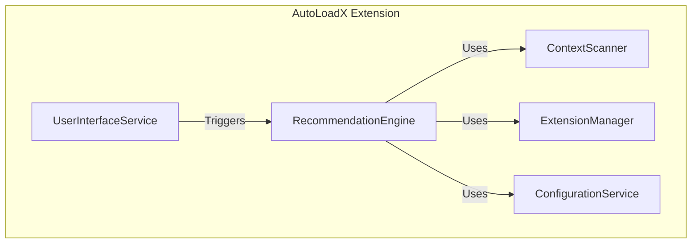

# Components

## ContextScanner

**Responsibility:** Scans the workspace to detect the project context (e.g., 'typescript', 'python'). **Key
Interfaces:**

- `scanWorkspace(): Promise<string[]>`: Scans the current workspace and returns an array of detected context names.
  **Dependencies:** `vscode.workspace` API **Technology Stack:** TypeScript

## ExtensionManager

**Responsibility:** Manages the state of VSCode extensions. It can inspect installed extensions and programmatically
enable or disable them. **Key Interfaces:**

- `getInstalledExtensions(): Promise<vscode.Extension<any>[]>`: Gets a list of all installed extensions.
- `enableExtension(id: string): Promise<void>`: Enables a specific extension.
- `disableExtension(id: string): Promise<void>`: Disables a specific extension. **Dependencies:** `vscode.extensions`
  API **Technology Stack:** TypeScript

## RecommendationEngine

**Responsibility:** Generates a list of recommended extension changes based on the detected project context. **Key
Interfaces:**

- `generateRecommendations(contexts: string[]): Promise<ExtensionRecommendation[]>`: Takes a list of project contexts
  and returns a list of recommendations. **Dependencies:** `ExtensionManager`, `ConfigurationService` **Technology
  Stack:** TypeScript

## ConfigurationService

**Responsibility:** Manages all configuration for the extension. It loads the default mappings and merges them with
user-defined settings from `settings.json`. **Key Interfaces:**

- `getMappings(): Promise<ExtensionMapping[]>`: Returns the final list of context-to-extension mappings.
- `getWhitelist(): string[]`: Returns the list of whitelisted extension IDs.
- `getBlacklist(): string[]`: Returns the list of blacklisted extension IDs. **Dependencies:**
  `vscode.workspace.getConfiguration` API **Technology Stack:** TypeScript

## UserInterfaceService

**Responsibility:** Handles all interaction with the user. This includes showing the approval prompt and logging actions
to the output channel. **Key Interfaces:**

- `showApprovalPrompt(recommendations: ExtensionRecommendation[]): Promise<boolean>`: Displays the modal dialog and
  returns `true` if the user approves.
- `logAction(message: string): void`: Logs a message to the "AutoLoadX" output channel. **Dependencies:**
  `vscode.window` API **Technology Stack:** TypeScript

## Component Diagram

