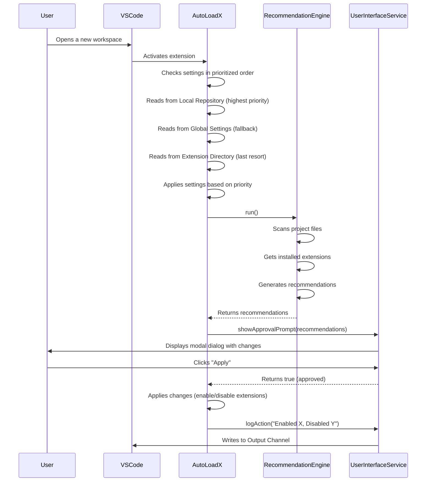

# Core Workflows

```mermaid
sequenceDiagram
    participant User
    participant VSCode
    participant AutoLoadX
    participant RecommendationEngine
    participant UserInterfaceService

    User->>VSCode: Opens a new workspace
    VSCode->>AutoLoadX: Activates extension
    AutoLoadX->>AutoLoadX: Checks settings in prioritized order
    AutoLoadX->>AutoLoadX: Reads from Local Repository (highest priority)
    AutoLoadX->>AutoLoadX: Reads from Global Settings (fallback)
    AutoLoadX->>AutoLoadX: Reads from Extension Directory (last resort)
    AutoLoadX->>AutoLoadX: Applies settings based on priority
    AutoLoadX->>RecommendationEngine: run()
    RecommendationEngine->>RecommendationEngine: Scans project files
    RecommendationEngine->>RecommendationEngine: Gets installed extensions
    RecommendationEngine->>RecommendationEngine: Generates recommendations
    RecommendationEngine-->>AutoLoadX: Returns recommendations
    AutoLoadX->>UserInterfaceService: showApprovalPrompt(recommendations)
    UserInterfaceService->>User: Displays modal dialog with changes
    User->>UserInterfaceService: Clicks "Apply"
    UserInterfaceService-->>AutoLoadX: Returns true (approved)
    AutoLoadX->>AutoLoadX: Applies changes (enable/disable extensions)
    AutoLoadX->>UserInterfaceService: logAction("Enabled X, Disabled Y")
    UserInterfaceService->>VSCode: Writes to Output Channel
```
