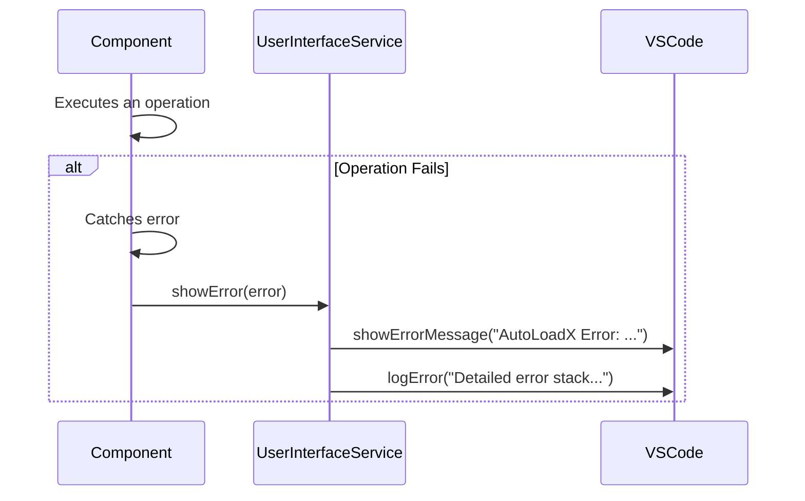

# Error Handling Strategy

## Error Flow



## Error Response Format

Since this is not a web API, there is no JSON error format. Errors will be presented to the user as a clear,
user-friendly message in a VSCode notification.

## Frontend Error Handling

The `UserInterfaceService` will be responsible for all user-facing error messages.

```typescript
// src/services/userInterfaceService.ts

public showError(error: Error): void {
    const userMessage = `AutoLoadX Error: ${error.message}`;
    vscode.window.showErrorMessage(userMessage);
    this.logError(error);
}

private logError(error: Error): void {
    this.outputChannel.appendLine(`[ERROR - ${new Date().toISOString()}] ${error.stack}`);
}
```

## Backend Error Handling

All operations that can fail (especially those interacting with the `vscode` API) will be wrapped in `try...catch`
blocks. When an error is caught, it will be passed to the `UserInterfaceService` to be displayed to the user.

```typescript
// Example from another service
try {
  // Some operation that might fail
  const files = await vscode.workspace.findFiles("**/*");
} catch (error) {
  this.uiService.showError(new Error("Failed to scan workspace files."));
}
```
